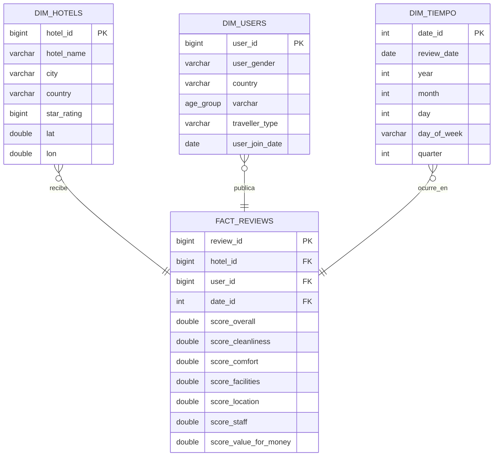

# Optimización de rankings hoteleros mediante inferencia bayesiana y similitud vectorial por perfil de usuario.

## Introducción
En la actualidad, las opiniones y calificaciones de los usuarios en plataformas digitales son el factor determinante al elegir un hotel. Sin embargo, las métricas que utilizan la mayoría de los sitios web presentan fallas importantes. Al calcular promedios aritméticos simples, se trata por igual a un hotel con cientos de evaluaciones que a uno con solo dos o tres opiniones perfectas. Esto genera rankings distorsionados e injustos, un problema que puede corregirse mediante promedios bayesianos, los cuales aplican una corrección probabilística para ajustar la puntuación según el volumen de reseñas.

La percepción de la relación calidad-precio es totalmente subjetiva. Lo que valora un viajero de negocios (como una buena conexión a internet o la ubicación) no es lo mismo que busca una familia o un turista internacional. Para demostrar estas diferencias de criterio de forma fundamentada, es necesario aplicar pruebas estadísticas de hipótesis como ANOVA o Kruskal-Wallis, analizando cómo varían las calificaciones según el perfil del usuario, la categoría del hospedaje y el tipo de turismo.

Los buscadores actuales son rígidos y muestran listas estáticas que obligan al usuario a filtrar manualmente entre cientos de opciones. Para resolver esto, este trabajo propone un sistema de recomendación adaptativo que utiliza la similitud coseno sobre vectores de calificaciones. De esta manera, es posible calcular qué tan parecidos son los hoteles entre sí y ofrecer recomendaciones personalizadas que se ajusten de forma automática a las prioridades de cada viajero.

## Planteamiento del Problema
En la industria hotelera contemporánea, las calificaciones de los usuarios son el principal motor para la toma de decisiones de nuevos clientes; sin embargo, las métricas tradicionales de evaluación presentan sesgos analíticos importantes. En primer lugar, los rankings basados en promedios aritméticos simples son altamente susceptibles al volumen muestral, permitiendo que destinos u hoteles con un número ínfimo de reseñas (ej. calificaciones perfectas de 5.0 con solo 2 o 3 evaluaciones) desplacen injustamente a establecimientos con un desempeño consistente a lo largo de cientos de reseñas.

En segundo lugar, la métrica de "relación calidad-precio" suele tratarse como un indicador universal, ignorando que la percepción de valor es inherentemente subjetiva y heterogénea. Esta percepción está condicionada por características demográficas, el propósito del viaje, la expectativa generada por la categoría del hotel y barreras socioculturales o económicas reflejadas en la condición del turista. Ignorar esta varianza estadística conduce a conclusiones sesgadas sobre el desempeño real del mercado hotelero.

Finalmente, los sistemas de búsqueda actuales suelen ofrecer listados estáticos que no se adaptan a las prioridades multidimensionales de cada segmento. Un viajero de negocios no pondera la ubicación y las instalaciones de la misma manera que un viajero de ocio o una familia. Por lo tanto, existe la necesidad de desarrollar un marco analítico que corrija las distorsiones métricas mediante inferencia bayesiana, valide estadísticamente las diferencias de percepción entre nichos de viajeros y proponga un sistema de recomendación dinámico basado en vectores de similitud y ponderaciones adaptativas.

## Justificacion del Problema

Los rankings hoteleros tradicionales basados en promedios simples generan distorsiones al igualar calificaciones de hoteles con miles de reseñas con los hoteles de apenas unas pocas. Para resolver esto, se propone el uso de promedios bayesianos, los cuales ajustan las puntuaciones con rigor estadístico para reflejar un ranking justo.

Asimismo, dado que la percepción de calidad-precio varía según la clasificacion de los usuarios (negocios, familias o turistas), el estudio utiliza pruebas estadísticas (ANOVA o Kruskal-Wallis) para validar estas diferencias por perfil.

Finalmente, para superar la rigidez de los motores de búsqueda actuales, se integra la similitud coseno vectorial, permitiendo recomendaciones adaptativas y personalizadas que simplifican la búsqueda del viajero.

## Pregunta principal de investigación

¿Cómo permite la combinación del promedio bayesiano y el análisis de similitud vectorial corregir el sesgo en las puntuaciones y optimizar la recomendación de alojamientos por clasificación de usuarios?

### Preguntas específicas de investigación

¿En qué medida el uso de promedios bayesianos altera el ordenamiento de destinos y hoteles al penalizar el bajo volumen de evaluaciones, en comparación con los modelos de ranking tradicionales basados en promedios simples?

¿Existen diferencias estadísticamente significativas en la percepción de la relación calidad-precio entre usuarios al segmentarlos por categoría del hotel, tipo de viajero, grupo etario y condición de turismo interno vs. receptivo, y cuál es la magnitud de dicho efecto? 

¿Cómo debe estructurarse la arquitectura matemática de un recomendador descriptivo para que el cálculo de puntajes ponderados refleje dinámicamente las preferencias históricas de cada perfil de viajero? 

## Objetivo General
Desarrollar un marco analítico integral para la evaluación y recomendación de alojamientos hoteleros, aplicando técnicas de corrección probabilística, pruebas de hipótesis y sistemas de similitud vectorial para optimizar la comprensión de la percepción de valor y mejorar la toma de decisiones de distintos perfiles de viajeros.

## Objetivos Específicos
- Construir y contrastar modelos de ranking de destinos y hoteles en función de su relación precio-calidad, implementando el cálculo de promedios bayesianos para penalizar estadísticamente a los establecimientos con bajo volumen de evaluaciones frente a los promedios simples.

- Determinar la existencia de diferencias estadísticamente significativas en la percepción de valor de los usuarios aplicando pruebas de varianza (ANOVA o Kruskal-Wallis, según la normalidad de los datos) y análisis de tamaño de efecto, segmentando la muestra por categoría del hotel, tipo de viajero, grupo etario y el contraste de turismo interno vs. receptivo.

- Diseñar la arquitectura matemática de un recomendador descriptivo que ordene los hoteles de un destino mediante un puntaje ponderado dinámico, donde los pesos de dimensiones específicas se calculen empíricamente según las preferencias históricas y el perfil del viajero.

- Implementar un motor de sugerencia de "hoteles similares" basado en el cálculo de similitud coseno, comparando los vectores n-dimensionales de las sub-calificaciones de cada establecimiento para ofrecer alternativas de alojamiento altamente correlacionadas a las preferencias del usuario.

## Diccionario de datos
El conjunto de datos se sustenta en tres tablas principales conectadas a través de los identificadores únicos de usuario (user_id) y hotel (hotel_id).

1. **Tabla hotels** (Catálogo de Hoteles):
Esta tabla funciona como catálogo de hoteles y contiene hoteles únicos con atributos clave como hotel_id, nombre, ciudad y categoría. Proporciona el contexto fundamental para todos los demás datos, lo que permite analizar el rendimiento de los hoteles según su ubicación y calidad.

Variable | Descripción | Uso en el Proyecto
:--- | :--- | :---
**hotel_id** | Identificador único del hotel. | Clave primaria para vincular con las reseñas.
**hotel_name** | Nombre comercial del hotel. | Identificación de establecimientos en dashboards y reportes.
**city** | Ciudad de ubicación del hotel. | Segmentación geográfica y análisis a nivel ciudad.
**country** | País de ubicación del hotel. | Análisis regional e internacional.
**star_rating** | Categoría o clasificación por estrellas. | Análisis de desempeño según la categoría del hotel.
**lat / lon** | Coordenadas de latitud y longitud geográfica. | Mapeo de ubicación y análisis de geolocalización.
**cleanliness_base** | Calificación base esperada para la limpieza. | Ranking inicial de calidad del establecimiento en limpieza.
**comfort_base** | Calificación base esperada para el confort y comodidad. | Ranking inicial de calidad en confort.
**facilities_base** | Calificación base esperada para las instalaciones. | Ranking inicial de calidad de la infraestructura.
**location_base** | Calificación base esperada para la ubicación. | Ranking inicial de atractivo de la zona.
**staff_base** | Calificación base esperada para el servicio del personal. | Ranking inicial de atención al cliente.
**value_for_money_base** | Calificación base esperada para la relación precio-calidad. | Ranking inicial de percepción de valor.

2. **Tabla users** (Perfil de Clientes):
Este archivo proporciona una lista de clientes únicos, ofreciendo información demográfica esencial con columnas como user_id, country y age. Estos datos son vitales para segmentar a los clientes y comprender cómo la demografía influye en el comportamiento de las reseñas

Variable | Descripción | Uso en el Proyecto
:--- | :--- | :---
**user_id** | Identificador único del cliente. | Clave primaria para relacionar con sus reseñas.
**user_gender** | Género registrado del usuario. | Segmentación de clientes por género.
**country** | País de origen o residencia del usuario. | Análisis de comportamiento por nacionalidad.
**age_group** | Rango de edad del usuario. | Análisis demográfico y perfilado de audiencia.
**traveller_type** | Tipo de viajero (Solo, Pareja, Familia, Negocios). | Segmentación de mercado y patrones de consumo.
**join_date** | Fecha de registro del usuario en la plataforma. | Cohortes de usuarios y análisis de antigüedad.

3. **Tabla reviews** (Transacciones y Evaluaciones):
Como tabla transaccional central, constituye el núcleo del conjunto de datos. Vincula a los usuarios con los hoteles que reseñaron, capturando detalles cruciales como review_id, hotel_id, user_id y una puntuación numérica de la reseña. Esta tabla es especialmente valiosa por su enfoque en la retroalimentación cuantitativa.

Variable | Descripción | Uso en el Proyecto
:--- | :--- | :---
**review_id** | Identificador único de la reseña. | Clave primaria de la transacción/evaluación.
**user_id** | Identificador único del cliente. | Clave foránea que conecta con la tabla **users**.
**hotel_id** | Identificador único del hotel. | Clave foránea que conecta con la tabla **hotels**.
**review_date** | Fecha de publicación de la reseña. | Análisis de tendencias temporales y estacionalidad.
**score_overall** | Calificación general otorgada por el cliente. | Métrica principal de satisfacción general del cliente.
**score_cleanliness** | Puntuación otorgada específicamente a la limpieza. | Evaluación de percepción de higiene y limpieza.
**score_comfort** | Puntuación otorgada al confort y las habitaciones. | Evaluación de comodidad del hospedaje.
**score_facilities** | Puntuación otorgada a las instalaciones y servicios. | Evaluación de infraestructura (piscina, wifi, gimnasio, etc.).
**score_location** | Puntuación otorgada a la ubicación del hotel. | Evaluación de la conveniencia de la localización.
**score_staff** | Puntuación otorgada a la atención del personal. | Evaluación de la calidad de servicio y trato al cliente.
**score_value_for_money** | Puntuación otorgada a la relación calidad-precio. | Evaluación de la percepción del costo vs. beneficio.
**review_text** | Texto explicativo o comentarios del cliente. | Minería de texto para la generación de embeddings para el recomendador descriptivo.

## Herramientas tecnológicas utilizadas
- Python: Lenguaje de programación multiproposito.

- Sqlite3: Motor de base de datos relacional ligero y sin servidor.

- DuckDB / Motherduck: DuckDB es un motor SQL analítico optimizado para procesamiento ultrarrápido de datos en local, y MotherDuck es su plataforma complementaria en la nube.

- PowerBI: Herramienta de inteligencia de negocios de Microsoft para la realización de dashboards interactivos.

## Bosquejo del Modelo de Datos Desnormalizado (Modelo Dimensional)

Para facilitar el procesamiento analítico, el cálculo eficiente de los Promedios Bayesianos y la ejecución de las pruebas de hipótesis, los datos se estructuran conceptualmente bajo un Modelo en Estrella (Star Schema) desnormalizado.

Este esquema centraliza las métricas y evaluaciones en una Tabla de hechos (Fact Table) rodeada por Tablas de Dimensiones, permitiendo responder directamente a los objetivos de investigación sin necesidad de realizar combinaciones complejas en tiempo de ejecución.

### Diagrama de Entidad-Relación (DER) - Modelo en Estrella
#### Código DBML del Modelo (dbdiagram.io)
> **Diagrama Interactivo:** Puedes explorar el diseño conceptual y lógico completo directamente en [dbdiagram.io (DER TF Compu2)](https://dbdiagram.io/d/DER-TF-Compu2-6ac9353f27cfb7f1bcc7c525).

#### Diagrama Visual (Mermaid)

### Cardinalidad y Relaciones entre Entidades

Las relaciones del esquema en estrella siguen un patrón estricto de Uno a Muchos ($1:N$) desde cada dimensión hacia la tabla de hechos:

**Dim_Hotel $\rightarrow$ Fact_Reviews ($1 : N$)**: Un hotel registrado puede recibir cero o múltiples reseñas, pero cada reseña pertenece a un único hotel.

**Dim_Usuario $\rightarrow$ Fact_Reviews ($1 : N$)**: Un usuario registrado puede publicar una o varias reseñas, pero cada reseña es emitida por un único usuario.

**Dim_Tiempo $\rightarrow$ Fact_Reviews ($1 : N$)**: Una fecha/día de la dimensión tiempo puede registrar cero o múltiples reseñas, pero cada reseña ocurre en una única fecha específica.

### Estructura del Modelo

#### 1. Tabla de Hechos: `Fact_Reviews`
Es la tabla central transaccional que contiene las mediciones numéricas cuantitativas asociadas a cada evaluación realizada.

**Claves de Conexión:**
- `review_id` (Clave primaria del hecho)
- `hotel_id` (Conecta con `Dim_Hotel`)
- `user_id` (Conecta con `Dim_Usuario`)
- `date_id` (Conecta con `Dim_Tiempo`)

**Métricas Cuantitativas:**
- `score_overall` (Métrica general)
- `score_cleanliness`
- `score_comfort`
- `score_facilities`
- `score_location`
- `score_staff`
- `score_value_for_money` (Métrica principal para la percepción de valor)

#### 2. Dimensiones

##### `dim_Hotel` 
Contiene la información descriptiva del establecimiento. Permite realizar la segmentación por categoría de hotel y agrupar las evaluaciones necesarias para el cálculo del Promedio Bayesiano.

**Atributos Clave:**
- `hotel_id` (PK)
- `hotel_name`
- `star_rating` (Crucial para la segmentación de la prueba ANOVA por categoría)
- `city` / `country` (Ubicación geográfica)
- `lat` / `lon` (Coordenadas espaciales)

##### `dim_users`
Almacena el perfil demográfico del cliente y su fecha de registro. Sirve de base para segmentar y responder al Objetivo Específico 2 (varianza en la percepción calidad-precio por perfil).

**Atributos Clave:**
- `user_id` (PK)
- `traveller_type` (Segmentación por tipo de viajero: Solo, Pareja, Familia, Negocios)
- `age_group` (Segmentación por grupo etario)
- `country` (Permite comparar Turismo Interno vs. Receptivo cruzándolo con la ubicación del hotel)
- `user_gender`
- `user_join_date` (Fecha de registro)

##### `dim_tiempo`
Permite descomponer la fecha de las evaluaciones para realizar análisis agregados por temporalidad y estacionalidad sin depender del tipo de dato texto de la fecha original.

**Atributos Clave:**
- `date_id` (PK)
- `review_date` (Fecha en formato DATE)
- `year` (Año de la reseña)
- `month` (Mes de la reseña)
- `day` (Día de la reseña)
- `day_of_week` (Día de la semana)
- `quarter` (Trimestre del año)

Dataset [en kaggle](https://www.kaggle.com/datasets/alperenmyung/international-hotel-booking-analytics)
